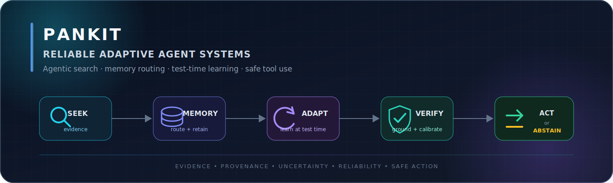

  

   
  
  
  

## About

I am **Pankit**, an AI systems builder focused on **Reliable Adaptive Agent Systems**: agents that know **when to search, what to remember, how to learn from feedback, and when to act or abstain**.

My work and research direction sit at the intersection of **information retrieval, agent memory, test-time learning, search-guided reasoning, and safe tool use**. I am especially interested in systems that are grounded in evidence, efficient under real constraints, and auditable from memory write to final action.

## Research focus

| Area | Problems I care about |
|---|---|
| **Adaptive evidence seeking** | Query planning, hybrid retrieval, source routing, reranking, provenance, evidence sufficiency, and budget-aware stopping |
| **Agent memory + test-time learning** | Episodic and semantic memory, consolidation, temporal validity, forgetting, reflection, feedback, and online adaptation |
| **Search-guided agent reasoning** | Trajectory search, process feedback, verification, uncertainty estimation, and calibrated act/abstain decisions |

## Featured work

### [TRACE-Mem](https://github.com/pxnkit/trace-mem)

An executable reliability layer for persistent AI agents that traces faults across the full **memory → retrieval → reasoning → action** path.

- Append-only, bi-temporal memory with active, superseded, and disputed states
- Controlled fault injection across memory writing, consolidation, retrieval, reasoning, and tool action
- Counterfactual replay for causal failure attribution and targeted repair
- Interaction-aware risk modeling and a pre-commit verification gate
- Reproducible local experiments with an offline HTML dashboard and JSON/CSV artifacts

`Python 3.10+` · `Standard Library` · `unittest` · `HTML/CSS` · `JSON/CSV`

  <a href="https://github.com/pxnkit/trace-mem"><strong>Repository →</strong></a>
  &nbsp;·&nbsp;
  <a href="https://github.com/pxnkit/trace-mem/blob/main/README.md"><strong>Technical overview →</strong></a>

## Technical profile

### Demonstrated in public work

  
  
  
  
  

TRACE-Mem is deliberately dependency-light: the current implementation uses Python's standard library so its reliability mechanisms and experiments remain easy to inspect and reproduce.

### Role-aligned toolkit and learning roadmap

The stack below is the ecosystem I am actively developing toward for the roles I am targeting. It is a roadmap for upcoming systems—not a claim that every tool has already shipped in a public repository.

  
  
  
  
  
  
  
  
  

| Layer | Technologies and methods |
|---|---|
| **Engineering + data contracts** | Python, Git, Linux, PostgreSQL/SQL, `uv` or pip-tools, Ruff, mypy/pyright, Pydantic, FastAPI, pytest, Docker, and GitHub Actions |
| **Models + test-time adaptation** | PyTorch, Hugging Face Transformers, Datasets, Accelerate, Sentence Transformers, PEFT/LoRA, TRL, vLLM, replay buffers, adapter versioning, and retention/forgetting evaluation |
| **Retrieval + evidence routing** | BM25/Lucene, dense bi-encoder embeddings, hybrid search with reciprocal-rank fusion, cross-encoder reranking, FAISS, PostgreSQL/pgvector, OpenSearch, filtered ANN/HNSW, query decomposition, source routing, provenance, and evidence-sufficiency stopping |
| **Agent memory + data plane** | Episodic, semantic, and procedural memory; append-only and bi-temporal event stores; PostgreSQL/pgvector for durable state; Redis for cache/coordination; DuckDB with Parquet/Arrow for trajectory and replay datasets; graph storage when traversal is first-class |
| **Agent runtime + reasoning search** | LangGraph or an explicit state machine, structured tool schemas, Model Context Protocol, durable checkpoints, timeouts/retries/idempotency, best-of-N, beam/tree/MCTS search, verifier or process-reward models, uncertainty scoring, and adaptive compute allocation |
| **Evaluation + observability** | `ir_datasets`/BEIR-style corpora, `ir_measures`/pytrec_eval/ranx, Recall@k, MRR, nDCG, Inspect AI or a custom harness, MLflow, OpenTelemetry traces, latency/cost budgets, Brier/ECE calibration, and risk–coverage/abstention curves |
| **Security + reliable action** | Sandboxed tools, least privilege, ACL-aware retrieval, secrets management, append-only provenance, pre-commit policy gates, prompt-injection tests, memory-poisoning tests, and deterministic counterfactual replay |

## Current exploration

- Learning retrieval and memory policies instead of relying only on fixed RAG pipelines
- Routing experience between context, external memory, and model updates
- Test-time adaptation from interaction, feedback, and failed trajectories
- Retrieval-grounded process verification for long-horizon reasoning
- Memory freshness, provenance, contradiction handling, and poisoning resistance
- Uncertainty-aware tool use and calibrated act/abstain behavior

## Next systems I want to build

- **Evidence Router** — learns whether to search, which source to query, and when the available evidence is sufficient
- **Adaptive Memory Lab** — evaluates retrieval, consolidation, forgetting, stale-memory detection, and memory poisoning
- **Reasoning Search Bench** — compares fixed reasoning, beam/tree search, process rewards, verification, and abstention

## Collaboration

I am interested in collaborating on **agent-memory benchmarks, retrieval policies, test-time adaptation, agent evaluation, and reliable tool-using systems**.

  

---

  <strong>Building agents that know when to search, remember, learn, act—or abstain.</strong>

<!--
Add public contact links here after confirming what should be published:
- LinkedIn
- Email
- Personal website
- Google Scholar
-->

